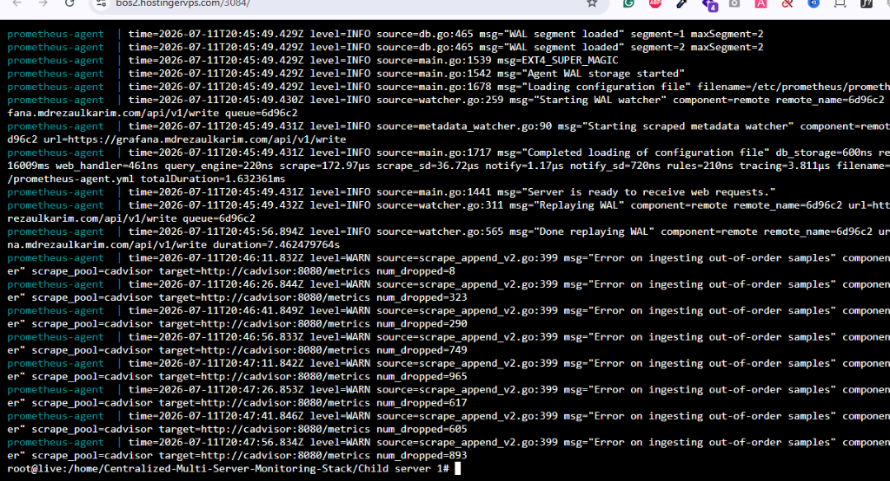
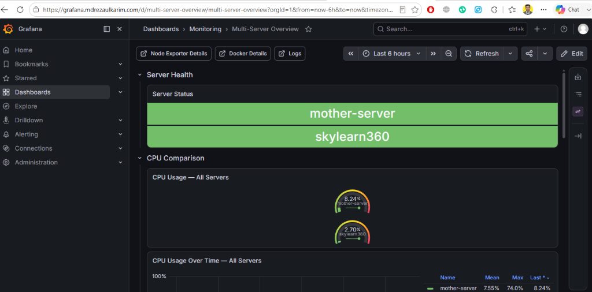
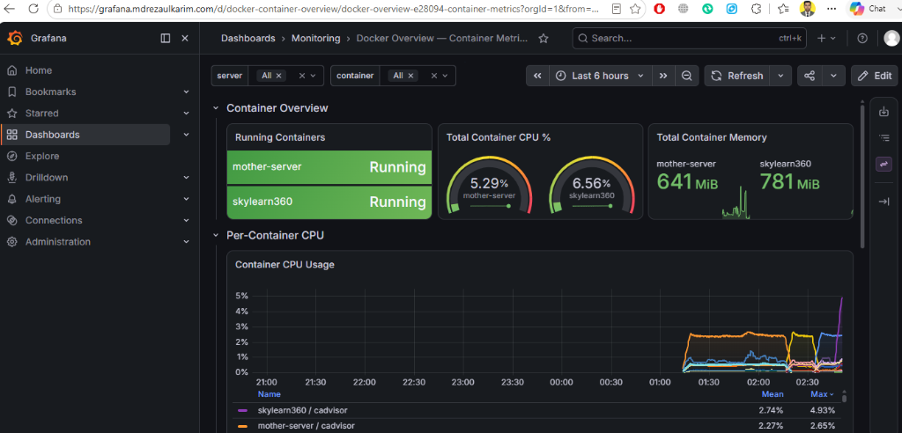

# 🚀 Centralized Multi-Server Monitoring Stack

A centralized, push-based monitoring system built on a **Mother Server** (AWS) pulling metrics and logs from **Hostinger VPS** and **Server 3** satellite hosts.

> [!TIP]
> Check out the [Troubleshooting & Verification Walkthrough](#-troubleshooting--verification-walkthrough) section at the bottom for step-by-step setup details, troubleshooting steps for cAdvisor and Prometheus Agent, success logs, and Grafana screenshot validations.

---

## 📦 Stack / Tech Used

| Technology   | Version   | Purpose                                                        |
|--------------|-----------|----------------------------------------------------------------|
| **Grafana**  | `latest`  | Centralized visualization and alerting dashboard UI            |
| **Prometheus**| `latest`  | Metrics collection engine (Mother server runs database; Agents run agent mode) |
| **Loki**     | `latest (v3.x)` | Log aggregation store on Mother Server                        |
| **Promtail** | `latest (v3.x)` | Log shipper parsing and forwarding container/system logs      |
| **Nginx**    | `latest`  | Hardened proxy handling HTTPS TLS encryption and basic auth    |
| **cAdvisor** | `latest`  | Container resource monitoring (CPU, RAM, network, disk)        |
| **Node Exporter**| `latest`| Hardware and OS metrics exporter                              |

---

## 📁 Project Structure

```
.
├── Mother Server/               # Mother Server (AWS) Stack
│   ├── docker-compose.yml       # Grafana, Loki, Alertmanager, Nginx, & Local Agents
│   ├── nginx.conf               # TLS proxy with basic-auth push endpoints
│   ├── prometheus.yml           # Central Prometheus (scrapes local + accepts remote_write)
│   ├── alertmanager.yml         # Alert router with webhook support
│   ├── promtail-config.yml      # Local Promtail agent config for Mother Server
│   ├── .env.example             # Central configuration environment variables
│   ├── rules/                   # Alerting rules
│   │   ├── node-alerts.yml      # OS/System alerts (CPU, memory, disk, network)
│   │   └── container-alerts.yml # Container status alerts
│   └── grafana/                 # Grafana provisioning-as-code
│       ├── provisioning/        # Auto-registered datasources & dashboards
│       └── dashboards/          # Multi-Server, System, Docker, and Loki dashboards
│
├── Child server 1/              # Hostinger VPS Agent
│   ├── docker-compose.yml       # Agent services (no exposed ports needed)
│   ├── prometheus-agent.yml     # Local scrape -> remote_write to Mother Server
│   ├── promtail-config.yml      # System & docker logs -> push to Loki
│   └── .env.example             # Hostinger-specific environment config
│
├── Child-server2/               # Server 3 (Generic VPS) Agent
│   ├── docker-compose.yml       # Agent services (no exposed ports needed)
│   ├── prometheus-agent.yml     # Local scrape -> remote_write to Mother Server
│   ├── promtail-config.yml      # System & docker logs -> push to Loki
│   └── .env.example             # Server 3 environment config
│
└── scripts/                     # Interactive Deployment Scripts
    ├── install-docker.sh        # Automated Docker & Docker Compose installer
    ├── configure-firewall.sh    # Firewall rule configuration helper
    ├── setup-central.sh         # Mother Server automated configuration wizard
    └── setup-agent.sh           # Agent configuration wizard
```

---

## ✅ Prerequisites

Before deployment, make sure the following are set up:

- **Docker & Docker Compose** installed on all servers. You can use the provided script to install Docker:
  ```bash
  chmod +x scripts/install-docker.sh
  sudo ./scripts/install-docker.sh
  ```
- **DNS record** pointing `grafana.mdrezaulkarim.com` to your Mother Server's public IP.
- Inbound security groups on Mother Server: Open ports **80** (HTTP), **443** (HTTPS), **3000** (Grafana UI), **9090** (Prometheus), **3100** (Loki), and **9093** (Alertmanager) to allow direct admin access and remote agent ingestion.

---

## 🔒 Firewall Configuration

You can use the provided firewall script to automatically open the required ports:

```bash
chmod +x scripts/configure-firewall.sh
sudo ./scripts/configure-firewall.sh
```

| Server Type | Required Inbound Ports | Purpose |
|-------------|-------------------------|---------|
| **Mother Server (AWS)** | `22/tcp` (SSH), `80/tcp` (HTTP), `443/tcp` (HTTPS), `3000/tcp` (Grafana), `9090/tcp` (Prometheus), `3100/tcp` (Loki), `9093/tcp` (Alertmanager) | SSH access, Let's Encrypt TLS renewal, Grafana web UI, and direct API access for metrics/logs ingestion. |
| **Agent Servers** | `22/tcp` (SSH) only | SSH access. *No inbound ports are needed for monitoring (outbound push only)* |

---

## 🔧 Configuration

### Mother Server Configuration (`Mother Server/.env`)

| Variable | Default Value | Description |
|----------|---------------|-------------|
| `DOMAIN` | `grafana.mdrezaulkarim.com` | Access domain for Grafana and metrics ingestion |
| `GF_ADMIN_USER` | `admin` | Grafana admin username |
| `GF_ADMIN_PASSWORD` | - | Grafana admin password (change on startup) |
| `AGENT_AUTH_USER` | `agent_user` | HTTP Basic Auth user for agent log/metrics push |
| `AGENT_AUTH_PASS` | - | Password for agent push authentication |
| `PROMETHEUS_RETENTION` | `30d` | Metrics storage retention limit |
| `ALERTMANAGER_WEBHOOK_URL`| - | Microsoft Teams/Power Automate webhook url |

---

## 🚀 Quick Start

### 1. Mother Server Installation

On the **Mother Server (AWS)**, run the configuration wizard:
```bash
chmod +x scripts/setup-central.sh
./scripts/setup-central.sh
```

*This script generates your `.env` file, fetches Let's Encrypt certificates, creates the basic auth password file, and runs the stack.*

#### 🔒 Installing/Renewing Let's Encrypt SSL Certificates:
To automate installing, renewing, and copying SSL certificates, run the dedicated SSL script:
```bash
chmod +x scripts/setup-ssl.sh
sudo ./scripts/setup-ssl.sh
```
*This script checks and installs Certbot, stops the Nginx proxy container if running (to free port 80), requests the certificate from Let's Encrypt, provisions it in `Mother Server/certs/`, and restarts the Nginx proxy container.*

If configuring manually:
```bash
# Obtain Let's Encrypt certificates
sudo certbot certonly --standalone -d grafana.mdrezaulkarim.com

# Copy certs
mkdir -p "Mother Server/certs"
sudo cp /etc/letsencrypt/live/grafana.mdrezaulkarim.com/fullchain.pem "Mother Server/certs/"
sudo cp /etc/letsencrypt/live/grafana.mdrezaulkarim.com/privkey.pem "Mother Server/certs/"

# Generate basic-auth credentials for agents
sudo apt install apache2-utils -y
htpasswd -c "Mother Server/htpasswd" agent_user

# Start central hub
cd "Mother Server"
cp .env.example .env  # Update variables inside .env
docker compose up -d
```

---

### 2. Satellite Agent Installation (Hostinger & Server 3)

No public inbound ports are required on agent servers.

#### Child server 1 setup (Hostinger VPS):
Copy the `Child server 1/` folder to the Hostinger server, then:
```bash
cd "Child server 1"
cp .env.example .env
# Edit .env and replace AUTH_PASS with the password created in htpasswd
docker compose up -d
```

#### Child-server2 setup (Server 3):
Copy the `Child-server2/` folder to Server 3, then:
```bash
cd "Child-server2"
cp .env.example .env
# Edit .env and replace AUTH_PASS with the password created in htpasswd
docker compose up -d
```

---

## 🐳 Docker Commands

| Command | Target Location | Description |
|---------|-----------------|-------------|
| `docker compose up -d` | Any directory | Start all services in the background |
| `docker compose down` | Any directory | Stop all services |
| `docker compose logs -f` | Any directory | Follow live container logs |
| `docker compose ps` | Any directory | Check container status |

---

## 📊 Pre-built Dashboards

Grafana automatically provisions the following dashboards under the `Monitoring` folder:
- **Multi-Server Overview**: Visual health index comparing CPU, RAM, Disk, and containers across all 3 servers side-by-side.
- **Node Exporter — System Metrics**: Core hardware details (Uptime, Disk IO, Network, Load) filterable by server.
- **Node Exporter Full** ([ID: 1860](https://grafana.com/grafana/dashboards/1860-node-exporter-full/)): Highly detailed, community-standard system metrics dashboard.
- **Docker Overview — Container Metrics**: Deep resource tracking of individual containers per server.
- **Loki — Centralized Logs**: Live stream visualizer for container and system logs (`/var/log/*`).

### 🎨 Customizing & Adding Dashboards

You can easily customize existing dashboards or import new ones from the [Grafana Dashboards Library](https://grafana.com/grafana/dashboards/):

1. **Add a New Dashboard**:
   Download the JSON file for the dashboard you want (for example, the [Node Exporter Full (1860)](https://grafana.com/grafana/dashboards/1860-node-exporter-full/) dashboard) and save it under the `Mother Server/grafana/dashboards/` directory:
   ```bash
   # Example: Download dashboard 1860 directly into the dashboards directory
   curl -sL "https://grafana.com/api/dashboards/1860/revisions/latest/download" -o "Mother Server/grafana/dashboards/node-exporter-full.json"
   ```
2. **Auto-Provisioning**:
   Grafana scans the `dashboards/` directory every 30 seconds. Any JSON dashboard placed here will automatically appear in your Grafana `Monitoring` folder.
3. **Save UI Customizations**:
   If you customize a dashboard within the Grafana UI, make sure to export the JSON from Grafana and save it back to `Mother Server/grafana/dashboards/` to make your changes persistent across container restarts.

---

## 🛠️ Troubleshooting & Local/IP Testing

If you are testing the installation using your server's IP address directly (without pointing a domain name first) or ran into syntax conflicts during setup, use the following commands:

### 1. Discard local git conflicts & pull latest code
If your git pulls are aborted due to local changes (e.g., executing setup scripts creates local changes/permissions issues):
```bash
git checkout scripts/setup-central.sh scripts/configure-firewall.sh "Mother Server/docker-compose.yml"
git pull
```

### 2. Configure Firewall (UFW)
To automatically configure ports including HTTP/HTTPS, SSH, and direct monitoring access (3000, 9090, 3100, 9093):
```bash
chmod +x scripts/configure-firewall.sh
sudo ./scripts/configure-firewall.sh
```

### 3. Expose ports on Server IP & run local setup
If you do not have a domain pointed yet, run the central configuration wizard using the server IP when prompted for the domain:
```bash
chmod +x scripts/setup-central.sh
sudo ./scripts/setup-central.sh
# Type your Server's Public IP (or localhost) for the domain.
# A self-signed fallback SSL certificate will be automatically generated to avoid Nginx startup crashes.
```

### 4. Pull Latest Stack & Restart
To fetch the latest docker image versions (`latest` tags) and restart clean:
```bash
cd "Mother Server"
docker compose pull
docker compose up -d --remove-orphans
```

---

## 📝 Changelog

| Version | Date       | Changes |
|---------|------------|---------|
| `1.2.0` | 2026-07-06 | Upgraded Loki to v3.x configuration, simplified Loki configurations removing deprecated options, removed Loki container healthcheck to resolve startup loops, adjusted Nginx dependencies to start Loki services correctly, added pre-provisioned Node Exporter Full dashboard (ID: 1860), and documented custom dashboard management guide. |
| `1.1.0` | 2026-07-06 | Simplified UFW comments to prevent syntax parsing errors, added automatic self-signed SSL fallback for IP-based local testing, updated all stack images to `latest`, and exposed UI/metrics ports publicly. |
| `1.0.0` | 2026-07-05 | Initial release with centralized Mother Server stack, auto-provisioned dashboards, and standalone Hostinger / Server 3 agents |

---

## 📄 License

MIT

---

## 👤 Author

**mdrezaulkarim**
- Website: [mdrezaulkarim.com](https://mdrezaulkarim.com)

---

## 📊 Troubleshooting & Verification Walkthrough

This section details the setup of the Let's Encrypt SSL script on the Mother Server and the troubleshooting steps taken to successfully start and verify the agents on the Child Server.

### 🔒 1. SSL Installation Script (Mother Server)

We created a dedicated bash script to automate SSL setup on the central hub:
* **Script Location:** [scripts/setup-ssl.sh](scripts/setup-ssl.sh)
* **Actions:** Installs Certbot, pauses Nginx to free port 80, requests Let's Encrypt certs, copies keys, and restarts Nginx.
* **Usage:**
  ```bash
  sudo ./scripts/setup-ssl.sh
  ```

### 🛠️ 2. Agent Troubleshooting & Resolutions (Child Server)

During deployment on **Child Server 1 (skylearn360)**, we resolved two critical issues:

#### Issue A: Port 8080 Conflict (cAdvisor)
* **Problem:** cAdvisor failed to bind to host port `8080` because it was already allocated to a WordPress container.
* **Resolution:** Changed the cAdvisor host port mapping from `"127.0.0.1:8080:8080"` to `"127.0.0.1:8082:8080"` in both child docker-compose files.

#### Issue B: Prometheus Agent Config & Startup Failures
1. **Feature Flag Mismatch:** Modern Prometheus versions use `--agent` instead of the deprecated `--enable-feature=agent` flag. We updated the container command.
2. **Deprecated Parameter:** The `max_retries` option under `queue_config` was deprecated/removed. We removed the line from the YAML configurations.
3. **Environment Expansion:** Prometheus lacks native environment expansion for YAML files. We reverted the `--config.expand-env` flag and ran the interactive `./scripts/setup-agent.sh` to correctly substitute variable placeholders statically.

### 📝 3. Troubleshooting Command Reference

Here are the commands used to diagnose and resolve the agent issues:

```bash
# Check container status
docker compose ps

# View real-time logs for Prometheus Agent
docker compose logs prometheus-agent

# Pull latest configurations from GitHub
git pull

# Force discard local modifications and align with GitHub
git fetch --all
git reset --hard origin/main

# Stop and clean up orphaned/created containers
docker compose down

# Run the interactive agent setup configuration wizard
./scripts/setup-agent.sh

# Recreate and start the stack cleanly
docker compose up -d
```

### 📊 4. Ingestion & Verification Screenshots

#### Prometheus Agent Success Logs
The agent successfully replayed the WAL and is sending metrics to Nginx:



#### Grafana Multi-Server Overview
The central Grafana dashboard confirms that both `mother-server` and `skylearn360` are reporting online with active CPU comparison metrics:



#### Docker Container Overview
Resource usage metrics (such as Memory and CPU %) from individual containers on `skylearn360` are being scraped and visualized correctly:


